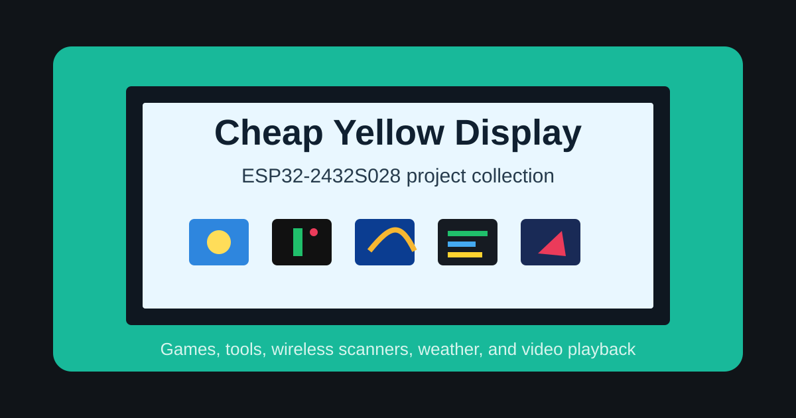

# Cheap Yellow Display Projects

A collection of Arduino sketches for the ESP32 Cheap Yellow Display
(ESP32-2432S028). The projects cover small games, touch utilities, wireless
scanning, weather display, PC control, and MJPEG video playback.

## Projects

| Folder | Project | Description |
| --- | --- | --- |
| `controlPC` | CYD PC Launchpad | Touch launcher that opens Windows apps over USB serial |
| `cyd_sd_video_player` | SD Video Player | Offline MJPEG player adapted from `thelastoutpostworkshop/esp32-2432S028_video_player` |
| `cyd_tv` | CYD TV | MJPEG HTTP stream viewer for cameras, PC streams, and SD video |
| `flappy_bird` | Flappy Bird | Touch-controlled Flappy Bird clone |
| `simon_says` | Simon Says | Color sequence memory game |
| `snake_game` | Snake | Classic Snake with touch-direction controls |
| `weather_monitor` | Weather Monitor | LVGL weather dashboard for multiple cities |
| `wifi_bt_scanner` | WiFi and BLE Scanner | Touch scanner for nearby WiFi networks and BLE devices |

## Common Hardware

Most sketches target this setup:

- ESP32-2432S028 Cheap Yellow Display
- ILI9341 320 x 240 TFT display
- XPT2046 resistive touch controller
- Arduino IDE 2.x

Some boards use different display controllers, pinouts, backlight pins, or SD
card wiring. Check each project README and sketch comments before flashing.

## Common Setup

1. Install Arduino IDE 2.x.
2. Install the ESP32 board package.
3. Select `ESP32 Dev Module` unless a project README says otherwise.
4. Install the libraries listed in the project README.
5. Configure `TFT_eSPI` with a CYD-compatible `User_Setup.h` when a project uses
   `TFT_eSPI`.
6. Open the `.ino` file from the matching folder and upload it.

## Notes

- Each project is intended to be opened from its own folder so the Arduino sketch
  name matches the directory name.
- Upload speed `921600` is used in most examples. If uploads fail, try `115200`.
- Close Arduino Serial Monitor before running any separate serial listener.
