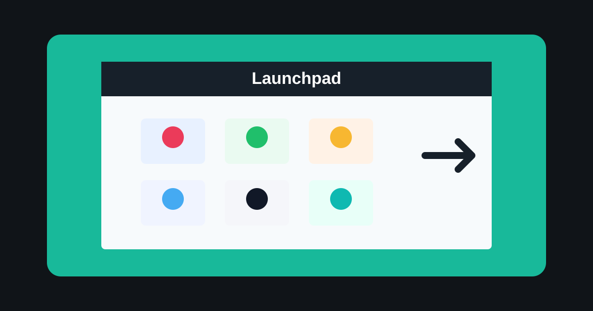

# CYD PC Launchpad

A touch launcher for the Cheap Yellow Display (ESP32-2432S028). Tap icons on
the CYD to open Windows apps over USB serial. The sketch provides two pages:
Apps & tools, and Microsoft Office.



## What You Need

| Part | Details |
| --- | --- |
| Board | ESP32 CYD with ILI9341 display and XPT2046 touch |
| PC | Windows 10 or 11 |
| Connection | USB data cable |
| Arduino IDE | 2.x recommended |
| Python | Python 3 with `pyserial` |

## Project Files

```text
controlPC/
|-- controlPC.ino
|-- icons.h
|-- pc_listener.py
|-- requirements.txt
|-- start_listener.bat
`-- tools/
    |-- generate_icons.py
    `-- requirements.txt
```

## Arduino Setup

1. In Arduino IDE, install `TFT_eSPI` and `XPT2046_Touchscreen`.
2. Configure `TFT_eSPI` with a CYD `User_Setup.h` for the ILI9341 display and
   ESP32-2432S028 pinout.
3. Open `controlPC.ino`.
4. Select board `ESP32 Dev Module`.
5. Select the CYD serial port, such as `COM3`.
6. Upload the sketch.

If upload fails with a wrong boot mode message, hold `BOOT`, press `RESET`,
release `BOOT`, then upload again.

Close Arduino Serial Monitor before running the listener. Only one program can
use the COM port at a time.

## PC Listener Setup

From this folder:

```powershell
python -m pip install -r requirements.txt
python pc_listener.py COM3
```

You can also double-click `start_listener.bat`. The default port is `COM3`; edit
the batch file or pass another port, such as:

```powershell
python pc_listener.py COM4
```

To find the port, open Device Manager and check `Ports (COM & LPT)` for a USB
serial device such as CH340.

## Daily Use

1. Plug in the CYD over USB.
2. Start `pc_listener.py` or `start_listener.bat`.
3. Tap an app icon to launch it on the PC.
4. Swipe left or right to switch between pages.

The listener prints a line such as `Listening on COM3 at 115200 baud...` when it
is ready.

## Apps Launched

| Page | Apps |
| --- | --- |
| Apps & tools | Fusion 360, eufyMake, Steam, Chrome, Cursor, Arduino IDE |
| Microsoft Office | Word, Excel, PowerPoint, Outlook, OneNote, Teams |

If an app is not found, edit paths or patterns in `pc_listener.py`, then restart
the listener.

## Regenerate Icons

Optional icon generation requires Pillow and Requests:

```powershell
pip install -r tools/requirements.txt
python tools/generate_icons.py
```

Custom PNGs can be placed in `assets/icons/` before running the generator. After
regenerating `icons.h`, upload `controlPC.ino` again.

## Display Rotation

The sketch currently uses rotation 3. To flip orientation, change both calls in
`controlPC.ino`:

```cpp
touchscreen.setRotation(3);
tft.setRotation(3);
```

Use `0`, `1`, `2`, or `3` until touch and display orientation match how you hold
the board.

## Troubleshooting

| Problem | Fix |
| --- | --- |
| Upload fails | Hold BOOT during upload, try 115200 baud, and use a data USB cable |
| Serial port busy | Close Serial Monitor and other apps using the COM port |
| Wrong app opens | Tap firmly without dragging, then check command handling in `pc_listener.py` |
| Swipe triggers by accident | Lift cleanly after tapping; the sketch separates taps from swipes by movement |
| App not found | Check listener output and update paths in `pc_listener.py` |
| Icon colors look wrong | Regenerate `icons.h` or restore it from the repo |

## License

Part of the `cheap_yellow_display` project.
