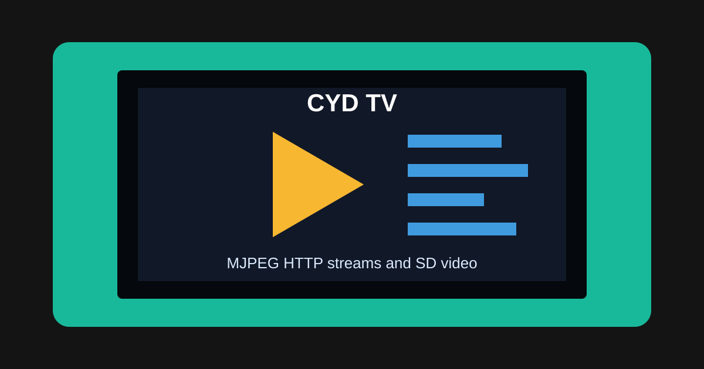

# CYD TV MJPEG Stream Viewer

Turn the ESP32 Cheap Yellow Display into a tiny MJPEG video viewer. It can play
simple MJPEG HTTP streams from IP cameras, local servers, or converted SD-card
video, within the practical limits of the ESP32.



## Supported Sources

| Source | Support |
| --- | --- |
| MJPEG HTTP streams | Supported |
| IP camera MJPEG substreams | Supported |
| PC-hosted MJPEG streams on the LAN | Supported |
| Converted raw MJPEG file from SD card | Supported |
| YouTube, Netflix, Twitch, RTSP, normal MP4 | Not supported |

The ESP32 does not decode H.264, H.265, RTSP, or normal MP4 files. Use MJPEG:
a stream of JPEG frames sent one after another.

## How to Use

1. Open `cyd_tv.ino` in Arduino IDE 2.x.
2. Flash it to the CYD.
3. On first boot, connect your phone or computer to the `CYD-TV` WiFi hotspot.
4. Use the WiFiManager page to select your home network.
5. Tap a channel on the CYD menu to start playback.
6. Tap the screen during playback to stop and return to the menu.

Edit channel URLs near the top of `cyd_tv.ino`:

```cpp
Channel channels[] = {
  { "Demo Cam",   "http://pendelcam.kip.uni-heidelberg.de/mjpg/video.mjpg" },
  { "Local Cam",  "http://192.168.1.231:8080/video" },
  { "PC Stream",  "http://192.168.1.50:8080/?action=stream" },
};
```

Replace the `192.168.1.x` addresses with your camera or PC IP address.

## SD Card Video

The sketch can play a raw MJPEG file from SD card. Convert your video first and
save it as:

```text
/video.mjpg
```

Recommended conversion settings:

```text
Resolution: 320 x 240
Frame rate: 5-10 FPS
Format: MJPEG
ffmpeg quality: about -q:v 10 to 14
```

If `ffmpeg` is installed, this folder includes a helper for a video currently
mounted on drive `E:`:

```powershell
powershell -ExecutionPolicy Bypass -File .\convert_video_to_sd_mjpeg.ps1
```

The helper writes `E:\video.mjpg`.

## PC Streaming

Good MJPEG sources include:

- Android IP Webcam app with MJPEG enabled
- `mjpg-streamer`
- MotionEye
- A small MJPEG multipart server fed by ffmpeg

The CYD needs a URL that returns `Content-Type: multipart/x-mixed-replace` with
JPEG frames.

## Hardware

- Board: ESP32-2432S028, also called the Cheap Yellow Display or CYD
- Display: ILI9341 2.8 inch, 320 x 240, landscape rotation 3
- Touch: XPT2046 resistive touch
- SD card: SPI SD module or onboard SD slot, depending on the board variant

## Required Libraries

| Library | Author | Notes |
| --- | --- | --- |
| TFT_eSPI | Bodmer | Configure with a CYD `User_Setup.h` |
| XPT2046_Touchscreen | Paul Stoffregen | Touch input |
| WiFiManager | tzapu | WiFi captive portal |
| JPEGDecoder | Bodmer | JPEG frame decoding |
| SD | ESP32 Arduino core | Built in |

## Build Settings

| Setting | Value |
| --- | --- |
| Board | ESP32 Dev Module |
| Partition Scheme | Minimal SPIFFS (1.9MB APP with OTA) |
| Upload speed | 921600 |

## Performance

- Expect about 5-15 FPS depending on WiFi, stream resolution, and JPEG size.
- FPS appears in the top-left corner while playing.
- Streams above 320 x 240 may work, but they are more likely to stutter.

## Project Structure

```text
cyd_tv/
|-- cyd_tv.ino
|-- convert_video_to_sd_mjpeg.ps1
|-- stream_server.py
|-- test_mjpeg_server.ps1
`-- README.md
```
