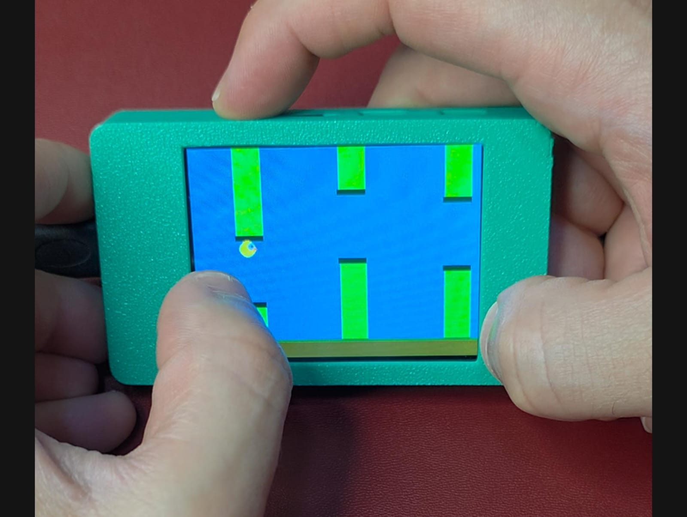
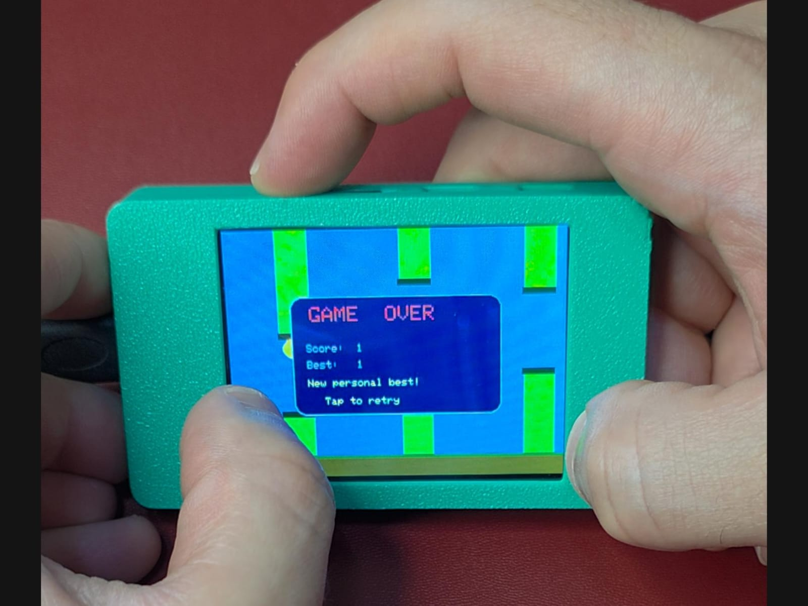

# Flappy Bird for ESP32 CYD

A compact Flappy Bird clone for the ESP32 Cheap Yellow Display
(ESP32-2432S028). Tap the touch screen to flap, pass through pipe gaps, and
try to beat the session high score.





## How to Play

- Tap anywhere on the screen to flap upward.
- Gravity pulls the bird down between taps.
- Fly through the gaps without hitting pipes, the ground, or the ceiling.
- Each gap passed scores 1 point.
- The high score is kept in memory until the board resets.

## Hardware

- Board: ESP32-2432S028, also called the Cheap Yellow Display or CYD
- Display: ILI9341 2.8 inch, 320 x 240, landscape rotation 3
- Touch: XPT2046 resistive touch on the VSPI bus

## Required Libraries

Install these from Arduino Library Manager.

| Library | Author | Notes |
| --- | --- | --- |
| TFT_eSPI | Bodmer | Configure with a CYD `User_Setup.h` |
| XPT2046_Touchscreen | Paul Stoffregen | Touch input |

## Build and Flash

1. Open `flappy_bird.ino` in Arduino IDE 2.x.
2. Select board `ESP32 Dev Module`.
3. Set upload speed to `921600`, or `115200` if uploads are unstable.
4. Upload the sketch.

## Technical Notes

The game avoids a full-screen sprite, which would use about 150 KB of RAM.
Instead, it uses small targeted redraws:

- Pipes scroll left by 2 pixels per frame. The newly exposed strip on the right
  edge is erased with the sky color before the pipe is redrawn.
- The bird uses a narrow 24 x 218 pixel `TFT_eSprite` column. Each frame, that
  column is rebuilt with sky, overlapping pipe sections, and the bird.

Physics values are tuned for about 30 FPS:

| Parameter | Value |
| --- | --- |
| Gravity | +0.25 px/frame^2 |
| Jump velocity | -5.0 px/frame |
| Max fall speed | 7.0 px/frame |
| Pipe speed | 2 px/frame |
| Frame time | 33 ms |

## Project Structure

```text
flappy_bird/
|-- flappy_bird.ino
`-- README.md
```
