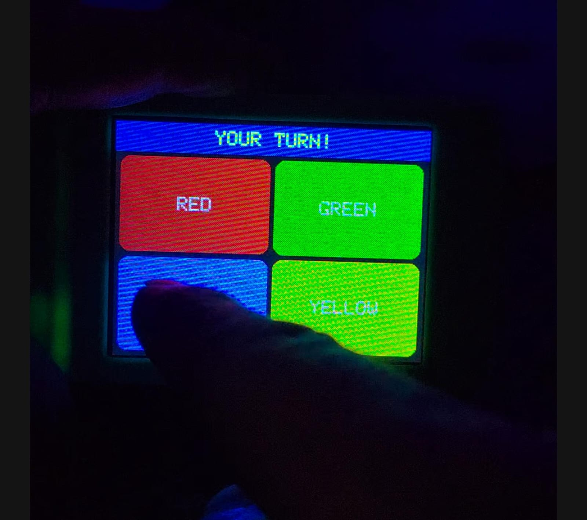

# Simon Says for ESP32 CYD

A memory sequence game for the ESP32 Cheap Yellow Display (ESP32-2432S028).
Watch the colors flash, then repeat the sequence by tapping the same buttons.



## How to Play

Four large buttons fill the screen:

| Position | Color |
| --- | --- |
| Top left | Red |
| Top right | Green |
| Bottom left | Blue |
| Bottom right | Yellow |

1. Watch the sequence flash.
2. Tap the colors back in the same order.
3. Each successful round adds one more step.
4. A wrong tap ends the game.

## Difficulty

The sequence gets faster every 5 rounds.

| Rounds | Flash timing |
| --- | --- |
| 1-5 | 500 ms on, 200 ms off |
| 6-10 | 380 ms on, 150 ms off |
| 11-15 | 280 ms on, 100 ms off |
| 16+ | 200 ms on, 100 ms off |

## Hardware

- Board: ESP32-2432S028, also called the Cheap Yellow Display or CYD
- Display: ILI9341 2.8 inch, 320 x 240, landscape rotation 3
- Touch: XPT2046 resistive touch on the VSPI bus

## Required Libraries

Install these from Arduino Library Manager.

| Library | Author | Notes |
| --- | --- | --- |
| TFT_eSPI | Bodmer | Configure with a CYD `User_Setup.h` |
| XPT2046_Touchscreen | Paul Stoffregen | Touch input |

## Build and Flash

1. Open `simon_says.ino` in Arduino IDE 2.x.
2. Select board `ESP32 Dev Module`.
3. Set upload speed to `921600`, or `115200` if uploads are unstable.
4. Upload the sketch.

## Project Structure

```text
simon_says/
|-- simon_says.ino
`-- README.md
```
