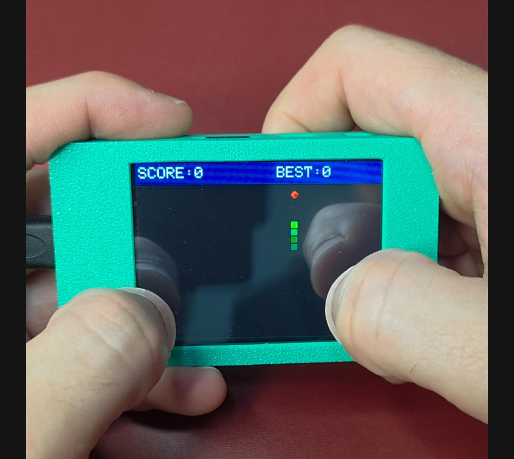

# Snake for ESP32 CYD

Classic Snake for the ESP32 Cheap Yellow Display (ESP32-2432S028). The snake
moves automatically, and you steer by tapping relative to the snake head.



## Gameplay

- Tap the screen to start or restart.
- Tap above, below, left, or right of the snake head to steer in that direction.
- Eat red food dots to grow and score points.
- Avoid the walls and the snake body.
- The high score is kept in memory until the board resets.

| Rule | Value |
| --- | --- |
| Score per food | 10 points |
| Starting speed | 150 ms per step |
| Speed increase | 2 ms faster per food |
| Minimum step time | 60 ms |

## Hardware

- Board: ESP32-2432S028, also called the Cheap Yellow Display or CYD
- Display: ILI9341 2.8 inch, 320 x 240, landscape rotation 3
- Touch: XPT2046 resistive touch on the VSPI bus

## Required Libraries

Install these from Arduino Library Manager.

| Library | Author | Notes |
| --- | --- | --- |
| TFT_eSPI | Bodmer | Configure with a CYD `User_Setup.h` |
| XPT2046_Touchscreen | Paul Stoffregen | Touch input |

## Build and Flash

1. Open `snake_game.ino` in Arduino IDE 2.x.
2. Select board `ESP32 Dev Module`.
3. Set upload speed to `921600`, or `115200` if uploads are unstable.
4. Upload the sketch.

## Layout

- Screen: 320 x 240 landscape
- Header: 28 px high score bar
- Grid: 32 columns x 21 rows
- Cell size: 10 x 10 px
- Maximum snake length: 672 cells

## Project Structure

```text
snake_game/
|-- snake_game.ino
`-- README.md
```
