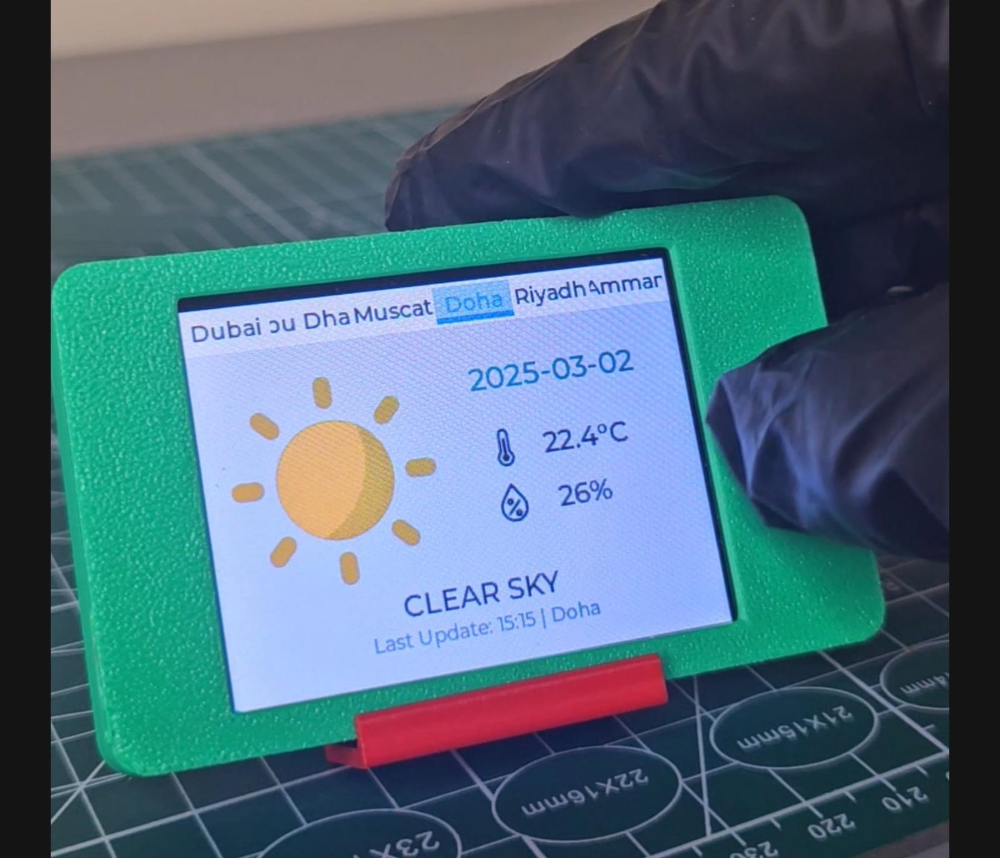

# Weather Monitor for ESP32 CYD

A touch-enabled weather dashboard for the ESP32 Cheap Yellow Display
(ESP32-2432S028). It uses LVGL for the interface, WiFi for network access, and
Open-Meteo style latitude/longitude weather data for multiple cities.



## Features

- Shows weather for Dubai, Abu Dhabi, Amman, Muscat, Doha, and Riyadh
- Displays temperature, humidity, date, update time, weather description, and
  weather icon
- Uses XPT2046 touch input
- Uses WiFiManager so network setup can be done from a captive portal
- Supports Celsius by default, with Fahrenheit available in the sketch

## Hardware

- Board: ESP32-2432S028, also called the Cheap Yellow Display or CYD
- Display: ILI9341 2.8 inch, portrait layout in the sketch
- Touch: XPT2046 resistive touch on the VSPI bus

## Required Libraries

Install these from Arduino Library Manager.

| Library | Notes |
| --- | --- |
| LVGL | UI framework |
| TFT_eSPI | Configure with a CYD `User_Setup.h` |
| XPT2046_Touchscreen | Touch input |
| ArduinoJson | JSON parsing |
| WiFiManager | WiFi captive portal |
| WiFi / HTTPClient | Included with the ESP32 Arduino core |

`weather_images.h` is included in this project and provides the weather icons.

## Build and Flash

1. Open `weather_monitor.ino` in Arduino IDE 2.x.
2. Select board `ESP32 Dev Module`.
3. Configure `TFT_eSPI` for the CYD display and pinout.
4. Install the required libraries.
5. Upload the sketch.
6. On first boot, use the WiFiManager portal to connect the board to WiFi.

## Configuration

| Setting | Purpose |
| --- | --- |
| `TEMP_CELSIUS` | Set to `1` for Celsius or `0` for Fahrenheit |
| `CityData` entries | Add or change city name, latitude, longitude, and time zone |
| `XPT2046_*` pins | Match touch wiring for your CYD variant |
| `SCREEN_WIDTH` / `SCREEN_HEIGHT` | Match the LVGL display orientation |

The sketch currently contains hard-coded WiFi credentials as well as
WiFiManager support. Prefer WiFiManager for shared code and avoid committing
private credentials.

## Project Structure

```text
weather_monitor/
|-- weather_monitor.ino
|-- weather_images.h
`-- README.md
```
