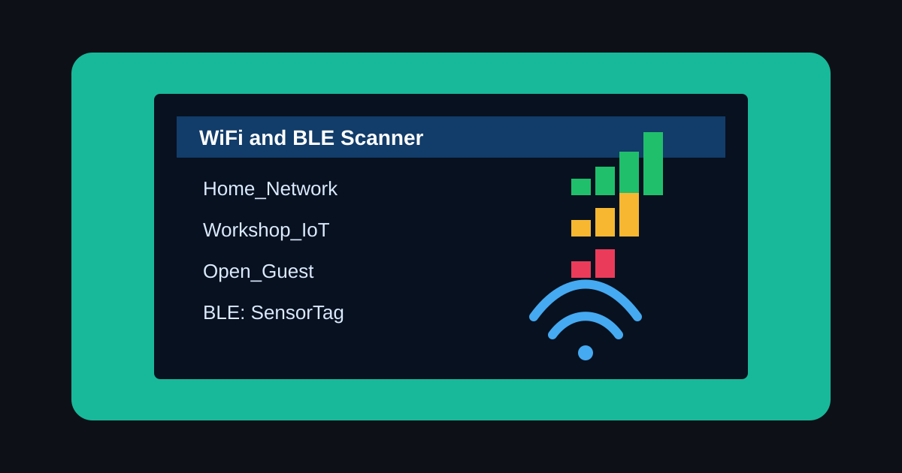

# WiFi and BLE Scanner for ESP32 CYD

A touch-driven wireless scanner for the ESP32 Cheap Yellow Display
(ESP32-2432S028). It scans nearby WiFi networks and Bluetooth LE devices,
then shows signal strength and useful device details on the CYD screen.



## Features

| Feature | Details |
| --- | --- |
| WiFi scan | Finds nearby networks and sorts them by signal strength |
| WiFi details | Shows SSID, BSSID, channel, RSSI, quality percentage, and security |
| Open-network connect | Tap an open network to connect and view IP, gateway, subnet, and DNS |
| BLE scan | Runs a 5-second active BLE scan |
| BLE details | Shows device name, MAC address, and RSSI |

## Controls

| Action | Touch control |
| --- | --- |
| Open a mode | Tap WiFi or BLE on the home screen |
| Open details | Tap a row in the scan list |
| Go back | Tap the `<` area in the header |
| Rescan | Tap `RESCAN` in the footer |
| Scroll | Tap `^` or `v` on the right edge |

## Hardware

- Board: ESP32-2432S028, also called the Cheap Yellow Display or CYD
- Display: ILI9341 2.8 inch, 320 x 240, landscape rotation 3
- Touch: XPT2046 resistive touch on the VSPI bus

## Required Libraries

Install these from Arduino Library Manager unless noted otherwise.

| Library | Author | Notes |
| --- | --- | --- |
| TFT_eSPI | Bodmer | Configure with a CYD `User_Setup.h` |
| XPT2046_Touchscreen | Paul Stoffregen | Touch input |
| WiFi | ESP32 Arduino core | Built in |
| BLEDevice / BLEScan | ESP32 Arduino core | Built in |

## Build and Flash

1. Open `wifi_bt_scanner.ino` in Arduino IDE 2.x.
2. Select board `ESP32 Dev Module`.
3. Set `Tools > Partition Scheme` to `Minimal SPIFFS (1.9MB APP with OTA)`.
4. Set upload speed to `921600`, or `115200` if uploads are unstable.
5. Upload the sketch.

WiFi and BLE together are too large for the default 1.25 MB app slot. If the
build still says the sketch is too big, use `Huge APP (3MB No OTA/1MB SPIFFS)`
or set `#define ENABLE_BLE 0` near the top of the sketch for a WiFi-only build.

## Notes

- WiFi scanning runs first. BLE scanning starts when you tap the BLE button.
- The sketch stores up to 20 WiFi networks and, when BLE is enabled, up to 20
  BLE devices.
- No full-screen sprite buffer is used, keeping RAM usage modest.

## Project Structure

```text
wifi_bt_scanner/
|-- wifi_bt_scanner.ino
`-- README.md
```
